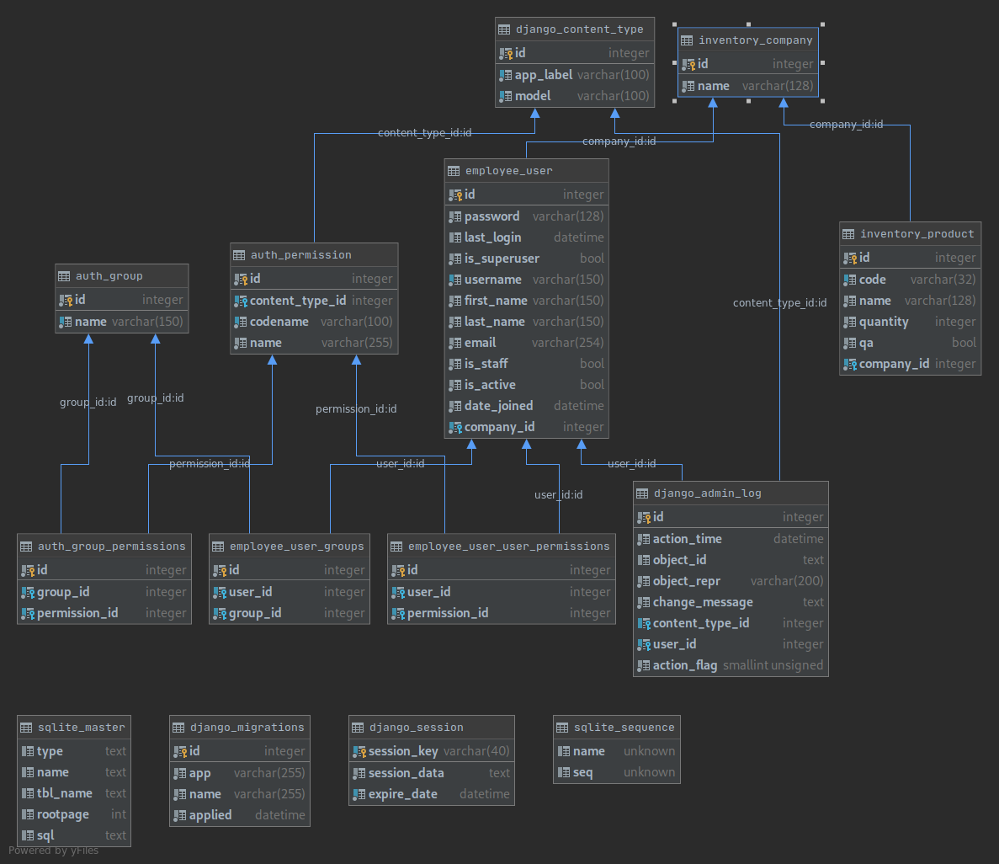

# Company Inventory

### Get started

python version 3.8
```bash
virtualenv -p python3.8 venv
source venv/bin/activate
pip install -r requirements.txt
./manage.py migrate
./manage.py initialsetup
```
note: There will be prompt for username of superuser and password. Normal user's username will start from user1 to 
user12 and password will be demo123  

## Models

- Users
- Company
- Product

## Diagram



## Roles

- INVENTORY_MANAGER
- QUALITY_ASSURANCE
- SALES_MANAGER
- IT_ADMIN

## routes

- /api/company
- /api/company/{pk}
- /api/product
- /api/product/{pk}
- /api/employee
- /api/employee/{pk}

## TODO
- [x] CRUD Inventory (company, product)
- [x] CRUD Employee
- [x] Role creation
- [x] Pagination
- [x] seeder command (faker)
- [x] Permission assigment
- [x] Model-level permission
- [x] Object-level permission
